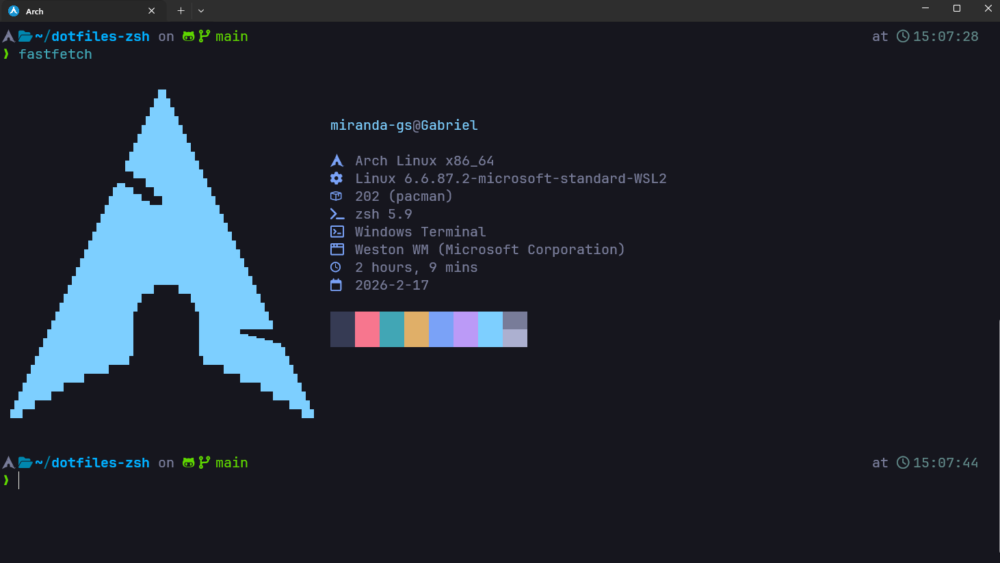

# 🚀 Pré-requisitos para Utilizar o `.zshrc`

Antes de importar e utilizar seu arquivo `~/.zshrc`, é importante garantir que algumas dependências estejam instaladas na sua máquina. Este guia apresenta as dependências necessárias e exemplos de como instalá-las no Arch Linux.

## 📦 Dependências

- **⚡ fastfetch**  
  Ferramenta para exibir informações do sistema no terminal.

- **🐱 fastcat**  
  Framework para alterar imagem exibida no fastfetch.

- **🌐 curl**  
  Ferramenta para transferências de dados via linha de comando.

- **🗜️ unzip**  
  Utilitário para descompactar arquivos `.zip`.

- **💻 zsh**  
  Shell avançado, recomendado para uma experiência mais rica no terminal.

- **🔌 zinit**  
  Gerenciador de plugins para o Zsh. Necessário para carregar plugins e temas no `.zshrc`.

- **🖋️ JetBrains Nerd Font Mono**  
  Fonte compatível com Nerd Fonts, utilizada para melhorar a exibição de símbolos e ícones no terminal.

---

## 🏗️ Como instalar no Arch Linux

Use o `pacman` para instalar os pacotes disponíveis nos repositórios oficiais:

```bash
sudo pacman -S fastfetch fastcat curl unzip zsh
```

### 🔌 Instalando o Zinit

O Zinit não está nos repositórios oficiais. Instale utilizando o comando oficial:

```bash
sh -c "$(curl -fsSL https://git.io/zinit-install)"
```

### � Plugins carregados pelo Zinit

A configuração presente em `~/.zshrc` carrega os seguintes plugins (via `zinit`) e annexes — cada um com uma função breve:

- **⚡ fast-syntax-highlighting** (`zdharma-continuum/fast-syntax-highlighting`) — realce de sintaxe em tempo real enquanto você digita, ajudando a detectar erros rapidamente.
- **🔎 history-search-multi-word** (`zdharma-continuum/history-search-multi-word`) — pesquisa no histórico por múltiplas palavras/fragmentos (mais flexível que a busca simples).
- **💡 zsh-autosuggestions** (`zsh-users/zsh-autosuggestions`) — sugestões automáticas de comandos baseadas no histórico (aceite com →).
- **📚 zsh-completions** (`zsh-users/zsh-completions`) — completions adicionais para muitas ferramentas que não têm suporte nativo.
- **🎨 powerlevel10k** (`romkatv/powerlevel10k`) — tema de prompt rápido e altamente customizável (execute `p10k configure` para ajustar).

- **🧩 Annexes do Zinit** (carregados em `light-mode`) — suporte interno/auxiliar do Zinit:
  - `zinit-annex-as-monitor` — suporte a execução/monitoramento assíncrono de tarefas do Zinit.
  - `zinit-annex-bin-gem-node` — helpers para instalar bins, gems (Ruby) e pacotes Node quando necessário.
  - `zinit-annex-patch-dl` — aplica correções/ajustes no processo de download quando requerido.
  - `zinit-annex-rust` — suporte a integrações/compilações relacionadas a ferramentas escritas em Rust.

> Dica: para modificar a lista de plugins edite `~/.zshrc` e depois rode `source ~/.zshrc` ou abra um novo terminal. ✨

### �🖋️ Instalando a JetBrains Nerd Font Mono

No Arch Linux, a JetBrains Nerd Font Mono pode ser instalada pelo AUR (Arch User Repository) usando, por exemplo, o `yay`:

```bash
yay -S nerd-fonts-jetbrains-mono
```

Se ainda não possui o `yay`, consulte as instruções de instalação [aqui](https://github.com/Jguer/yay).

---

### ⚠️ Observação Importante sobre WSL2

Se você estiver utilizando **WSL2** no Windows, a instalação da fonte **JetBrains Nerd Font Mono** deve ser feita **no próprio Windows** — não no ambiente Linux.

Passos recomendados:

1. Baixe a fonte no site oficial do [Nerd Fonts](https://www.nerdfonts.com/font-downloads).
2. Instale-a no Windows clicando duas vezes sobre o arquivo `.ttf` e escolhendo "Instalar".
3. Abra o Windows Terminal, vá em "⚙️ Configurações", selecione o perfil do Ubuntu/WSL, e ajuste a fonte para "JetBrainsMono Nerd Font".

**Assim, os ícones e símbolos aparecerão corretamente no terminal do Windows.**

---

## ✅ Após instalar as dependências

Após seguir os passos acima, você já pode importar seu arquivo `~/.zshrc` e aproveitar os recursos do seu ambiente personalizado! ✨



*resultado final ao importar o ~/.zshrc*

---
